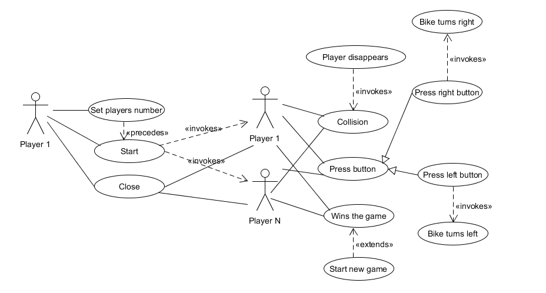

<h2> Funkcionális követelmények</h2>
#### Use Case
Általános felhasználás

#### User Stories

##### Kezdőképernyővel kapcsolatos User Story-k

<table>
	<tr>
		<th>1</th>
		<th>Játék indítása</th>
	</tr>
		<tr>
		<td>Actor</td>
		<td>Player1</td>
	</tr>
	<tr>
		<td>Előfeltétel</td>
		<td>'Play' gombra kattintás és játékosok számának beállítása (default: 2)</td>
	</tr>
	<tr>
		<td>Eredmény</td>
		<td>Megjelenik a játék képernyője, rajta a megfelelő számú játékossal</td>
	</tr>
	<tr>
		<td>Kiváltja</td>
		<td>A játékos a 'Play' gombra kattint a menüben</td>
	</tr>
	
</table>

<table>
	<tr>
		<th>2</th>
		<th>Játék bezárása</th>
	</tr>
		<tr>
		<td>Actor</td>
		<td>Player1</td>
	</tr>
	<tr>
		<td>Előfeltétel</td>
		<td>'Exit' vagy a bezárás gombra kattintás</td>
	</tr>
	<tr>
		<td>Eredmény</td>
		<td>A program bezárodik</td>
	</tr>
	<tr>
		<td>Kiváltja</td>
		<td>A játékos a 'Exit' vagy a bezárás gombra kattint a menüben</td>
	</tr>
	
</table>
<table>
	<tr>
		<th>3</th>
		<th>Játékosok számának megadása</th>
	</tr>
		<tr>
		<td>Actor</td>
		<td>Player1</td>
	</tr>
	<tr>
		<td>Előfeltétel</td>
		<td>A csúszkával a játékosok számának megadása (default: 2)</td>
	</tr>
	<tr>
		<td>Eredmény</td>
		<td>A játék indításával, megfelelő számú új Actor jön létre: Player2,... és jelenik meg a játék képernyőjén</td>
	</tr>
	<tr>
		<td>Kiváltja</td>
		<td>A játékosok számának beállítása a menüben</td>
	</tr>
	
</table>

##### Játékképernyővel kapcsolatos User Story-k

<table>
	<tr>
		<th>4</th>
		<th>Egy játékos tetszőleges irányba fordul</th>
	</tr>
		<tr>
		<td>Actor</td>
		<td>Player1, Player2, ...</td>
	</tr>
	<tr>
		<td>Előfeltétel</td>
		<td>A menüben a játékosok száma be van állítva és meg lett nyomva a 'Play' gomb</td>
	</tr>
	<tr>
		<td>Eredmény</td>
		<td>A játék indításával és a jobbra irány lenyomásával a megfelelő játékos motorja jobbra fordul a balra iránnyal pedig balra</td>
	</tr>
	<tr>
		<td>Kiváltja</td>
		<td>Player1, Player2, ... a megfelelő irányt lenyomja majd felengedni</td>
	</tr>
	</tr>
    	<tr>
    		<td>Események</td>
    		<td>
    		    <li>A játékosok lenyomják a megfelelő irányhoz tartozó gombot</li>
                <li>A képernyőn a játékosok motorja a lenyomott iránynak megfelelően fordul fordul</li>
                <li>A játékosok által megtett út kirajzolódik</li>
            </td>
    </tr>
	
</table>
<table>
	<tr>
		<th>5</th>
		<th>Egy játékos egy irányt lenyomva tart</th>
	</tr>
		<tr>
		<td>Actor</td>
		<td>Player1, Player2, ...</td>
	</tr>
	<tr>
		<td>Előfeltétel</td>
		<td>A menüben a játékosok száma be van állítva és meg lett nyomva a 'Play' gomb</td>
	</tr>
	<tr>
		<td>Eredmény</td>
		<td>A motor automatikusan indul el és az egyik irány lenyomva tartásával folyamatosan kanyarodik abba az irányba</td>
	</tr>
	<tr>
		<td>Kiváltja</td>
		<td>Player1, Player2, ... egyik irány lenyomva tartása</td>
	</tr>
	</tr>
    	<tr>
    		<td>Események</td>
    		<td>
    		    <li>A játékos lenyomva tartja az egyik irányt </li>
                <li>A játékos motorja folyamatosan kanyarodik</li>
                <li>A játékos által megtett út kirajzolódik</li>
            </td>
    </tr>
	
</table>

<table>
	<tr>
		<th>6</th>
		<th>Egy játékos mindkét irányt egyszerre lenyomja</th>
	</tr>
		<tr>
		<td>Actor</td>
		<td>Player1, Player2, ...</td>
	</tr>
	<tr>
		<td>Előfeltétel</td>
		<td>A menüben a játékosok száma be van állítva és meg lett nyomva a 'Play' gomb</td>
	</tr>
	<tr>
		<td>Eredmény</td>
		<td>A motor automatikusan indul el és mindkét irány egyidejű lenyomva tartásával egyenesen halad</td>
	</tr>
	<tr>
		<td>Kiváltja</td>
		<td>Player1, Player2, ... mindkét irányt egyszerre tartja lenyomva</td>
	</tr>
	</tr>
    	<tr>
    		<td>Események</td>
    		<td>
    		    <li>A játékos lenyomja a két irányt egyszerre</li>
                <li>A képernyőn a játékos motorja egyenesen halad nem fordul el</li>
                <li>A játékos által megtett út kirajzolódik</li>
            </td>
    </tr>
	
</table>

<table>
	<tr>
		<th>7</th>
		<th>Egy játékos saját magába ütközik és meghal</th>
	</tr>
		<tr>
		<td>Actor</td>
		<td>Player1, Player2, ...</td>
	</tr>
	<tr>
		<td>Előfeltétel</td>
		<td>A menüben a játékosok száma be van állítva és meg lett nyomva a 'Play' gomb</td>
	</tr>
	<tr>
		<td>Eredmény</td>
		<td>A motor automatikusan indul el és a játékos addig nyomja tetszőlegesen a gombokat, míg az általa már megtett útba ütközik</td>
	</tr>
	<tr>
		<td>Kiváltja</td>
		<td>Az irányok megfelelő lenyomásai</td>
	</tr>
	</tr>
    	<tr>
    		<td>Események</td>
    		<td>
    		    <li>A játékos lenyomja az irányokat megfelelően</li>
                <li>A játékos által megtett út kirajzolódik</li>
                <li>A játékos már kirajzolt útnak megy</li>
                <li>A játékos és általa rajzol út eltűnik</li>
            </td>
    </tr>
	
</table>

<table>
	<tr>
		<th>8</th>
		<th>Egy játékos falba ütközik és meghal</th>
	</tr>
		<tr>
		<td>Actor</td>
		<td>Player1, Player2, ...</td>
	</tr>
	<tr>
		<td>Előfeltétel</td>
		<td>A menüben a játékosok száma be van állítva és meg lett nyomva a 'Play' gomb</td>
	</tr>
	<tr>
		<td>Eredmény</td>
		<td>A motor automatikusan indul el és a játékos addig nyomja tetszőlegesen a gombokat, míg falba nem ütközik</td>
	</tr>
	<tr>
		<td>Kiváltja</td>
		<td>Az irányok megfelelő lenyomásai</td>
	</tr>
	</tr>
    	<tr>
    		<td>Események</td>
    		<td>
    		    <li>A játékos lenyomja az irányokat megfelelően</li>
                <li>A játékos által megtett út kirajzolódik</li>
                <li>A játékos falnak megy</li>
                <li>A játékos és általa rajzol út eltűnik</li>
            </td>
    </tr>
	
</table>

<table>
	<tr>
		<th>9</th>
		<th>Egy játékos másik játékosba ütközik és meghal</th>
	</tr>
		<tr>
		<td>Actor</td>
		<td>Player1, Player2, ...</td>
	</tr>
	<tr>
		<td>Előfeltétel</td>
		<td>A menüben a játékosok száma be van állítva és meg lett nyomva a 'Play' gomb</td>
	</tr>
	<tr>
		<td>Eredmény</td>
		<td>A motorok automatikusan indulnak el és a játékosok(Player1, Player2, ...) addig nyomják tetszőlegesen a gombokat, míg az egyik a másik által már megtett útba ütközik</td>
	</tr>
	<tr>
		<td>Kiváltja</td>
		<td>Az irányok megfelelő lenyomásai a játékosok részéről(Player1, Player2, ...)</td>
	</tr>
	</tr>
    	<tr>
    		<td>Események</td>
    		<td>
    		    <li>A játékosok lenyomják az irányokat megfelelően</li>
                <li>A játékosok által megtett útak kirajzolódnak különböző színnel</li>
                <li>Az egyik játékos(Player1, Player2, ...) már kirajzolt útnak megy</li>
                <li>Az ütköző játékos és általa rajzol út eltűnik</li>
            </td>
    </tr>
	
</table>

<table>
	<tr>
		<th>10</th>
		<th>Egy játékos nyer</th>
	</tr>
		<tr>
		<td>Actor</td>
		<td>Player1, Player2, ...</td>
	</tr>
	<tr>
		<td>Előfeltétel</td>
		<td>A menüben a játékosok be van állítva és meg lett nyomva a 'Play' gomb</td>
	</tr>
	<tr>
		<td>Eredmény</td>
		<td>A motorok automatikusan indulnak el és a játékosok(Player1, Player2, ...) addig nyomják tetszőlegesen a gombokat, míg egyet leszámítva minden játékos a másik által már megtett útba, saját útba vagy falba ütközik</td>
	</tr>
	<tr>
		<td>Kiváltja</td>
		<td>Az irányok megfelelő lenyomásai a játékosok részéről(Player1, Player2, ...)</td>
	</tr>
	</tr>
    	<tr>
    		<td>Események</td>
    		<td>
    		    <li>A játékosok lenyomják az irányokat megfelelően</li>
                <li>A játékosok által megtett útak kirajzolódnak különböző színnel</li>
                <li>Egyet leszámítva minden játékos(Player1, Player2, ...) már kirajzolt útnak vagy falnak megy</li>
                <li>Az ütköző játékosok és általuk rajzolt útak eltűnnek</li>
                <li>A játékos, amely nem ütközött nyer</li>
                <li>A játéknak vége, a menübe visszatér a program</li>
            </td>
    </tr>
	
</table>